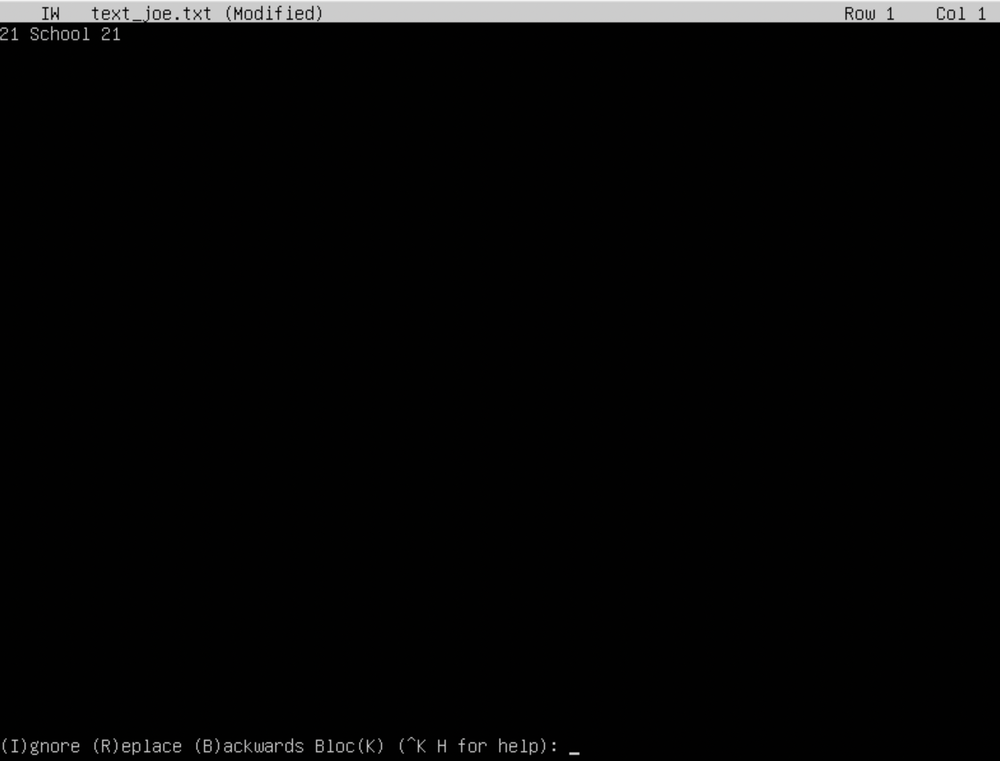

## Task 1

## Task 2

## Task 3

1) Для изменениея имени машины пришлось изменить файл /etc/hostname командой sudo vim /etc/hostname \
2) Для изменения временой зоны пришлось вывести командой timedatectl list-timezones список доступных временых зон. После изменить командой sudo timedatectl set-timezone Europe/Moscow \

3) Для вывода названий сетевых интерфейсов использовал команду ip link
\
lo (loopback device) – виртуальный интерфейс, присутствующий по умолчанию в любом Linux. Он используется для отладки сетевых программ и запуска серверных приложений на локальной машине. С этим интерфейсом всегда связан адрес 127.0.0.1. У него есть dns-имя – localhost.
\
4) Для получения ip адересов используется команда ip address
\
DHCP (Dynamic Host Configuration Protocol) - cетевой протокол, позволяющий сетевым устройствам автоматически получать IP-адрес и другие параметры, необходимые для работы в сети TCP/IP
\
5) Для вывода внешнего и внитреннего ip адреса ипользовал команду ip route
\
6) 

## Task 4

## Task 5

Команда sudo предоставляет возможность пользователям выполнять команды от имени суперпользователя root, либо других пользователей. Правила, используемые sudo для принятия решения о предоставлении доступа, находятся в файле /etc/sudoers

## Task 6

## Task 7 
1)
JOE для выхода "control + k", затем "q" и подтвердить сохранение "y" \

VIM для выхода из режима редактирования используется "esc" после ":" и команда "qw" \

NANO для "control + x" для выхода "y" для подтверждения сохранения \

2)
JOE для выхода "control + k", затем "q" и отменить сохранение "n" \
 

VIM для выхода из режима редактирования используется "esc" после ":" и команда "q!" для выхода без сохранения изменений \

NANO для "control + x" для выхода "n" для отмены сожранений \

3)
JOE для поиска и замены слов в файле "control + k", затем "f". Далее воодится слово для замены, нажимается "R" и вводится на что менять слово. \

VIM для поиска используется команда "/" c перемещением посредством "n" и "N" \
для замены команда ":s/патерн посика/замена" \  

NANO для поиска control + w для замены control + \

## Task 8

Для установки SSH и запуска соответствующего демона выполнена команда: sudo apt install ssh \
\
Для добавления автоматического запуска демона ssh  при загрузке системы использовалась команда: sudo systemd enable sshd \
\
Для перенастройки службы SSHd на порт 2022 необходимо было отредактировать файл: /etc/ssh/sshd_config . Я делал это через vim, раскоментировав строку с портом и заменив его на 2022  \

Для вывдоа демона ssh использовалась команда: ps -aux | grep ssh \

- Параметр a указывает ps отображать процессы всех пользователей. Не отображаются только процессы, не связанные с терминалом, и процессы руководителей групп.
- u обозначает ориентированный на пользователя формат, который предоставляет подробную информацию о процессах.
- Параметр x указывает ps перечислить процессы без управляющего терминала. В основном это процессы, которые запускаются во время загрузки и работают в фоновом режиме . \

Вывод команды: netstat -tan

- t информация по протоколам TCP; 
- a Показывает состояние всех сокетов; обычно сокеты, используемые серверными процессами, не показываются.
- n Показывает сетевые адреса как числа. netstat обычно показывает адреса как символы. Эту опцию можно использовать с любым форматом показа. \

Proto - протокол TCP или UDP \
Recv-Q - Счётчик байт не скопированных программой пользователя из этого сокета \
Send-Q - Счётчик байтов, не подтверждённых удалённым узлом \
Local Address - IP -адрес локального компьютера и номер используемого порта \
Foreign Address - IP -адрес и номер порта удалённого компьютера, к которому подключен сокет если есть *, значит порт ещё не установлен \
State - указывает состояние TCP - соединения \
 
## Task9

Uptime – это время непрерывной доступности ресурса (сайта/хостинга/сервера) (3:36) \
количество авторизованных пользователей 1 \
общую загрузку системы за мин: 0.00 за 5: 0.00 за 15: 0.00 \
общее количество процессов - 125 \
загрузка cpu: \
    процент времени процессора, затраченного на выполнение  пользовательских процессов (us) 0.0 \
    процент времени процессора, затраченного на выполнение процессов ядра (sy) 0.0 \
    процент времени процессора, затраченного на выполнение пользовательских процессов с ограничениями (ni) 0.0 \
    процент времени процессора проведённое в режиме ожидания (id) 99.7 \
    процент времени процессора потраченное на ожидание на периферийных устройствах (wa) 0.0 \
загрузка памяти: \
    физическая память (Mem) \
        общий объем ОЗУ (total) 8205.6 \
        количество свободной памяти (free) 7437.4 \
        количество занятой памяти (used) 194.5 \
        зарезервированная системой память (buff/cache) 573.7 \
    виртуальная память или пространство подкачки (Swap) \
        общий объем ОЗУ (total) 0.0 \
        количество свободной памяти (free) 0.0 \
        количество занятой памяти (used) 0.0 \
        память который может быть выделена для процессов, не использую \ большую область диска (avail Mem) 7769.7 \
pid процесса занимающего больше всего памяти 693 \
pid процесса, занимающего больше всего процессорного времени 1931 \

Сортировка по PID htop \

Сортировка по PERCENT_CPU \

Сортировка по  PERCENT_MEM \

Сортировка по TIME \

Фильтр для процесса sshd \

Найден процесс syslog \

Добавлен вывод hostname, clock и uptime \

## Task 10

название жёсткого диска sda; \
его размер 14.02 GiB; \
количество секторов на диске 29431216; \
размер swap 0.0 GiB \

## Task 11

размер раздела 10218772 KiB \
размер занятого пространства 4238536 KiB \
размер свободного пространства 5439564 KiB \
процент использования 44% \

размер раздела 9.8 GiB \
размер занятого пространства 4.0 GiB \
размер свободного пространства 5.3 GiB \ 
процент использования 44% \

## Task 12

du -h /home \

du -h /var \

du -h /var/log \

du -h /var/log/* \

## Task 13

ncdu /home \

ncdu /var \

ncdu /var/log \

## Task 14

Лог последнего входа \
Время последней успешной авторизации - 15:05:29 \
Имя пользователя - zero \
Способ входа аутентификации в режиме pam_unix \

Перезагрузка sshd \

## Task 15

Вывыод измененного планировщика CRON \

Логи \

Очищены задачи CRON \
